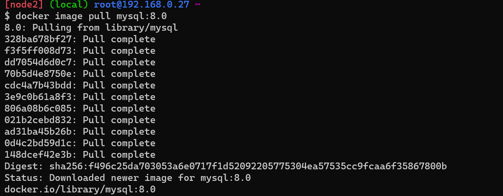
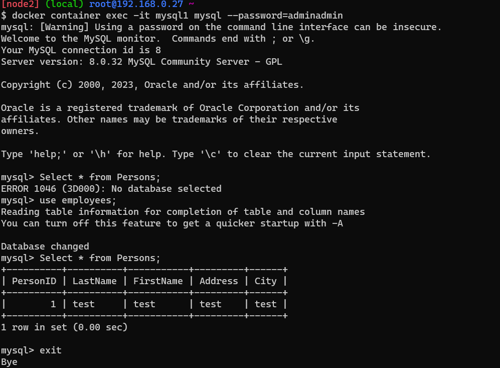

# MYSQL Container with Volume.
* Docker pull image 
  ````
  docker image pull mysql:8.0
  ````


* Docker Conatiner 
```
docker container run -d --name mysql1 -v mysqldb:/var/lib/mysql -P -e MYSQL_ROOT_PASSWORD=adminadmin -e MYSQL_DATABASE=employees -e MYSQL_USER=rkdevops -e MYSQL_PASSWORD=adminadmin mysql:8.0
````

* Docker Container Mysql login 
````
docker container exec -it mysql1 mysql --password=adminadmin
````


* Then After we need to delete the Container and Create the New Container With Same volume then we need to Check the Data of Mysql.

* remove Container 
```
docker container rm -f mysql1
```
* New Container withe Same Volume Mount
```
docker container run -d --name mysql1 --mount "source=mysqldb,target=/var/lib/mysql,type=volume" -P -e MYSQL_ROOT_PASSWORD=adminadm
in -e MYSQL_DATABASE=employees -e MYSQL_USER=rkdevops -e MYSQL_PASSWORD=adminadmin mysql:8.0
```

* The Login into the Conatiner By using Command
```
docker container exec -it mysql1 mysql --password=adminadmin
``` 



* To inspect The container 
```
docker container inspect <container name>
```

* To Check the Logs of Container.
  ```
  docker container logs <container name>
  ```
