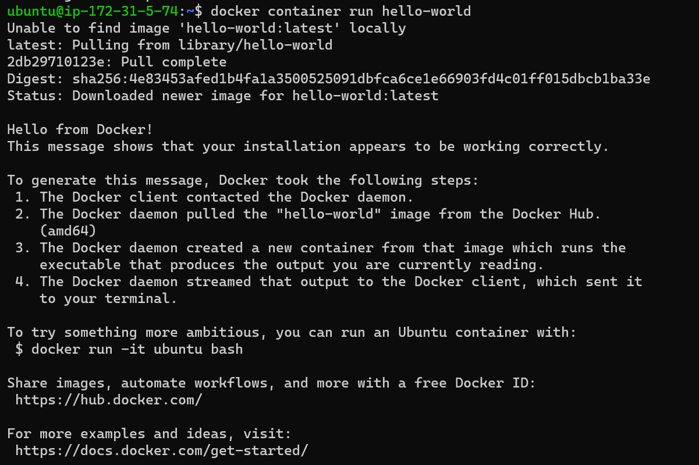
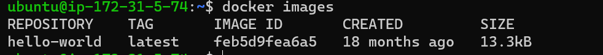
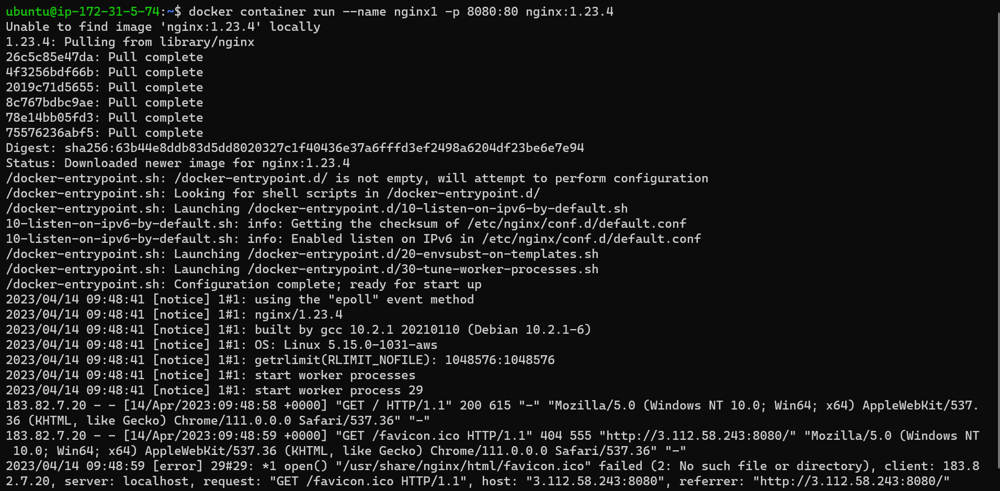
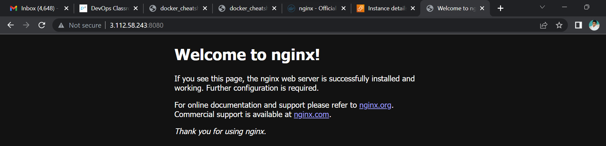

# Run hello-world docker container and observe the container status

* After running the Command "Docker container run hello-world"
* it has Given the Status of Docker as "Download Newer image for hello-world:latest"

### Below is the Image for reference of the status after runnig the command.


#  Check the docker images and also write down the size of hello-world image

* To check the Docker images the Command is "docker images"
  * Then we can see the details of images.
      * Repository
      * TAG
      * Image ID
      * Created 
      * Size
  * Docker Image Size is 13.3KB.
  ### Belwo the Image Reference to cheeck the docker image Size
  


# Run the nginx container with name as nginx1 and expose it on 8080 port on docker host.
* Command to Run the Nginx.
```
docker conatiner run --name nginx1 -p 8080:80 nginx:1.23.4
```
Below Is the reference for Check the Image Nginx run.


* Using Port 8080.
  

