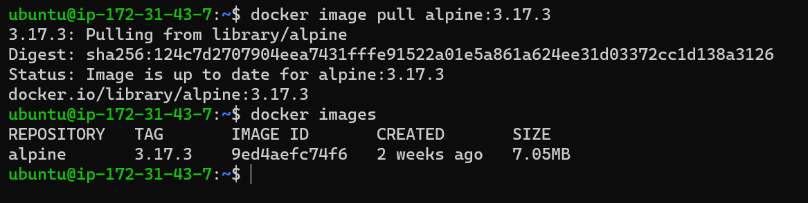
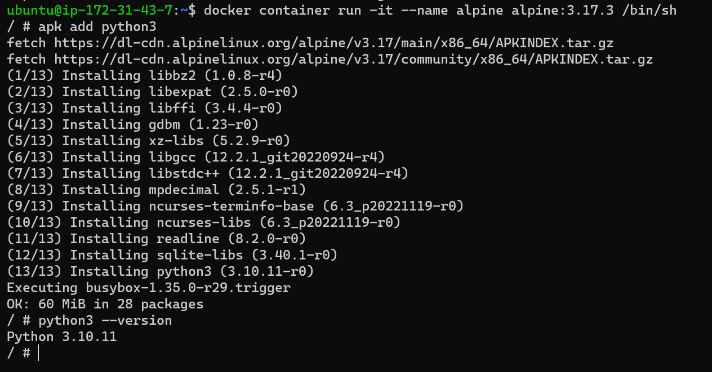
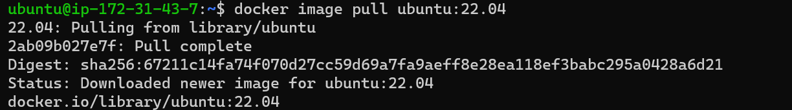
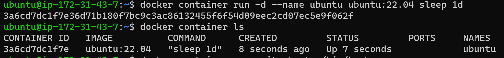
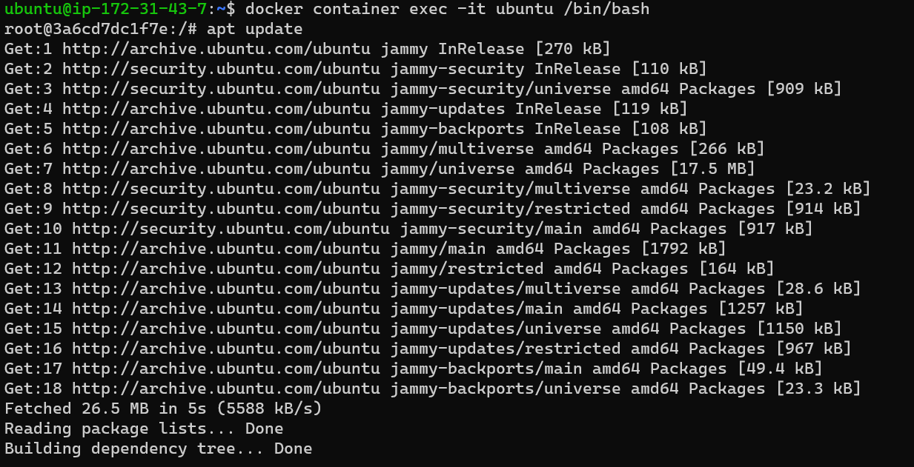
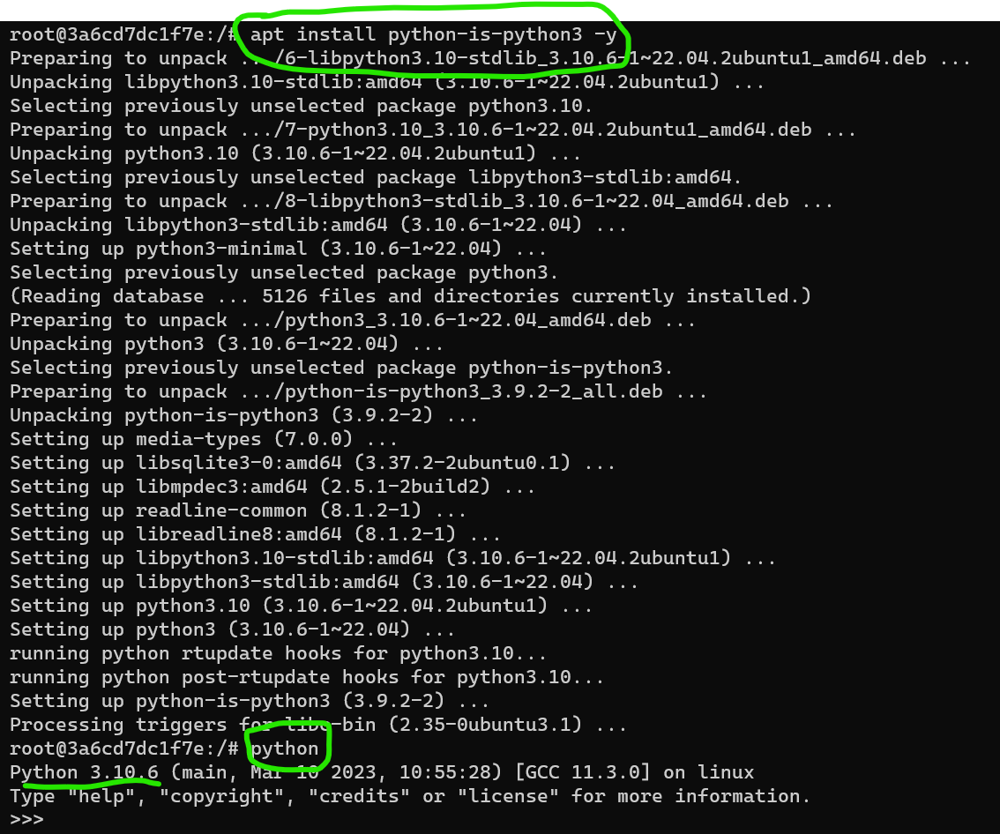
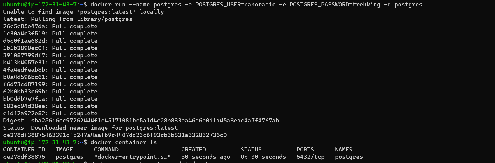
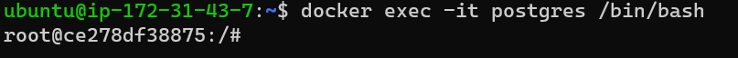
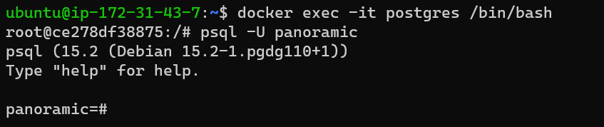
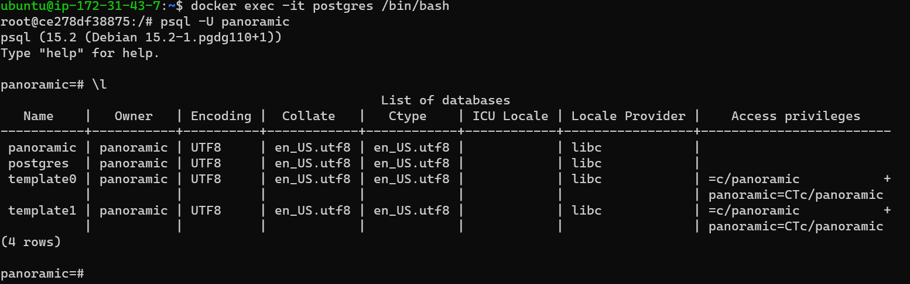

# 1.CREATE ALPINE CONTAINER IN INTERACTIVE MODE AND INSTALL PYTHON.

* To Pull the alpine Image.
  ```
  docker image pull alpine:3.17.3
  ```
  

* To create Alpine Container In interactive Mode.
  ```
  docker container run -it --name alpine alpine:3.17.3 /bin/sh
  ```
* To install python in alpine container.
   ```
   apk add python3
   ```
   


# 2.Create a ubuntu container with sleep 1 day and the login using exec . install Python.

* To pull the Docker image .
  ```
  docker image pull ubuntu:22.04
  ```


### Creating the ubuntu container with sleep1d.
```
docker container run -d --name ubuntu ubuntu:22.04 sleep 1d
```
* with below image reference the container is created and Running.


* To login to the Ubuntu Container
  ```
  docker container exec -it ubuntu /bin/bash
  ``` 
  

* To Install Python in ubuntu Container.
  ```
  apt install python-s-python3 -y
  ```
* with below Image reference Python is install and the version is python.
    

# 3.Create a postgres container with user panoramic  and password as trekking . try to login in and show the databases(query for the psql)

* Creating the postgres container with user panoramic and password as treeking.
```
docker run --name postgres -e POSTGRES_USER=panoramic -e POSTGRES_PASSWORD=trekking -d postgres
```


* To login to the container and access the PostgreSQL server we can use the following command
  ```
  docker exec -it postgres /bin/bash
  ```


* To login into the postgres(panoramic) user.
  ```
  psql -U panoramic
  ```


* After Logging into the Paronamic user to query the psql databases use below:
  ```
  \l
  ```
 * With the reference image we can see the query databases details.
   



   


