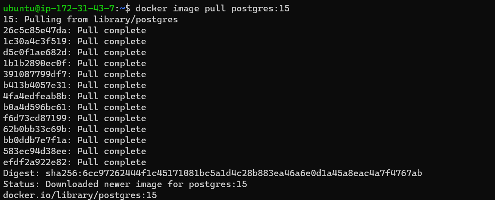
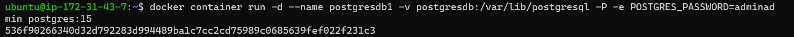
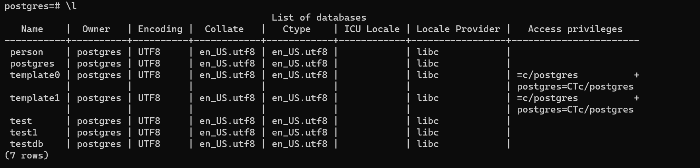
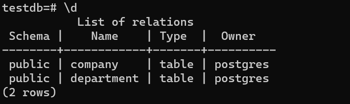
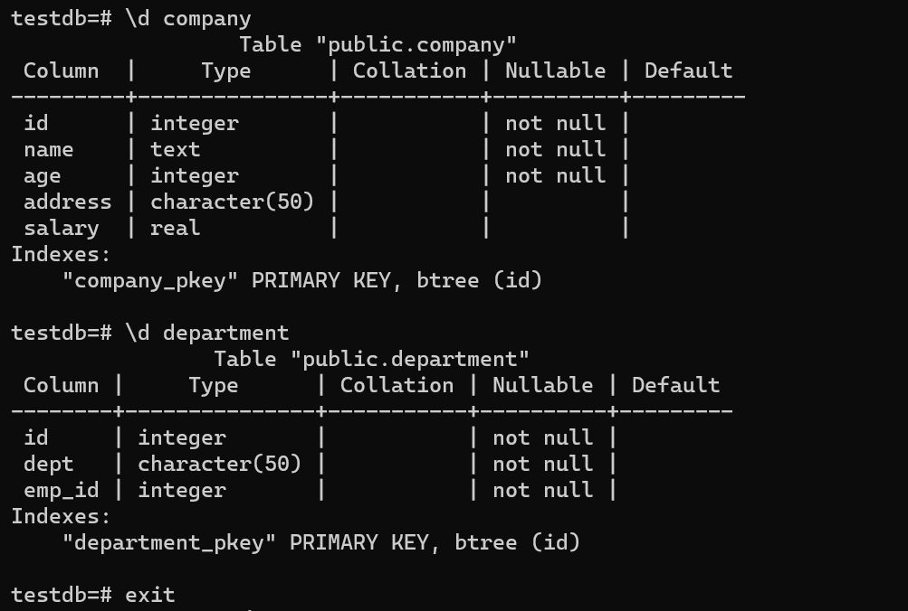

# POSTGRES
* TO Pull The Image From the Docker registry
  ```
  docker image pull postgres:15
  ```



 * TO create The Docker Container
```
docker container run -d --name postgresdb1 -v postgresdb:/var/lib/postgresql -P -e POSTGRES_PASSWORD=adminadmin postgres:15
```


* TO login into the Container 
```
docker container exec -it postgresdb1 /bin/bash
```

* To login to the PostgresDb
```
psql -h localhost -U postgres
```

* To create Database in it
```
CREATE DATABASE testdb;
```
* In postgress to chek the databases 
  ```
  \L
  ```



* TO change Direct \c Test
```
\c testdb
```

* TO create tables in post gress.

```
CREATE TABLE COMPANY(
   ID INT PRIMARY KEY     NOT NULL,
   NAME           TEXT    NOT NULL,
   AGE            INT     NOT NULL,
   ADDRESS        CHAR(50),
   SALARY         REAL
);
```

```
 CREATE TABLE DEPARTMENT(
   ID INT PRIMARY KEY      NOT NULL,
   DEPT           CHAR(50) NOT NULL,
   EMP_ID         INT      NOT NULL
);
```

* To check the list os table '\d'
 

  

 * Next Data has created.
 * we can delete the container and create new container with the same volume.
 * then after loggin into the Container we need to see the data in it.


# need to check this.
docker run --name postgres-test -e POSTGRES_PASSWORD=password -p 5432:5432 -v postgres-data:/var/lib/postgresql/data -d postgres:latest