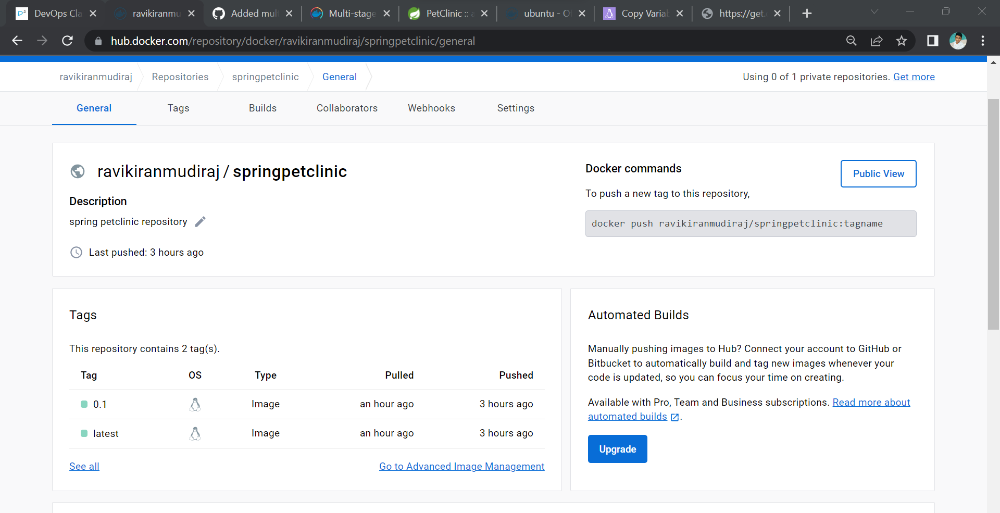
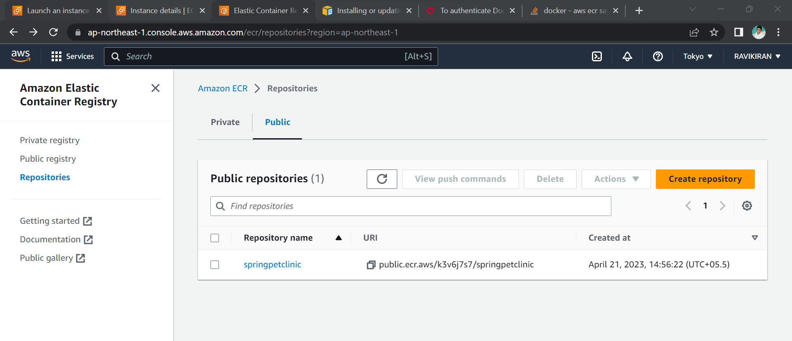

# Spring Petclinic Multi Staged build.

```
FROM alpine/git AS VCS
RUN cd / && git clone https://github.com/spring-projects/spring-petclinic.git

FROM maven:3-amazoncorretto-17 AS builder
COPY --from=VCS /spring-petclinic /spring-petclinic
RUN cd /spring-petclinic && mvn package


FROM amazoncorretto:17-alpine3.17-jdk AS executor
EXPOSE 8080
ARG HOME_DIR=/spc
WORKDIR ${HOME_DIR}
COPY --from=builder /spring-petclinic/target/spring-petclinic-3.0.0-SNAPSHOT.jar ${HOME_DIR}/spring-petclinic.jar
EXPOSE 8080
CMD ["java","-jar","spring-petclinic.jar"]
```

### For Building the Image
```
docker build -t spc:1 .
``` 


```
docker container run -d -P spc:1 .
```
* Container in running state.
  

* By loggin the Port SPRING PETCLINI IS RUNNING THE WEB PAGE.


## Now Pushing the Image to DOCKER HUB REGISTRY.

* Need to Login Docker HUB.


* Need to Create Public Repository In Docker HUB Account.
  
* After building the image tag the image to new naming format.
  ```
  docker image tag spc:1 ravikiranmudiraj/springpetclinic:latest
  ```

* Then The Images need to Push The Docker hub.

```
docker image push -a ravikiranmudiraj/springpetclinic
```


* All the Images will Be Pushed To the Docker HUB Public repository which we have created.
  

  * Check the images we Have Pushed to The Docker HUB Repository.

.


# PUSHING THE IMAGE TO AWS ELASTIC CONTAINER REGISTRIES(ECR):

* In Aws we need to Create a Public Repositories in ECR.
* Created Repository in ECR Below Reference.
  

### First we need to download awscli.
* Configuring the Awscli using Access key and Secret ID

* Then in AWS ECR we can see the (View PUSH commands).
* There we can see the Commands to push The images TO AWS ECR repository which we have created.
* From Docker I had pulled the Image of Spring petclinic.


* Then Image Tag Name Format Need to Change as per the AWS.
  
* Then As Per the AWS Command Pushed to The AWS public Repository.
  
  

### AWS ECR repository After Pushed the Image TO ECR REPO.


